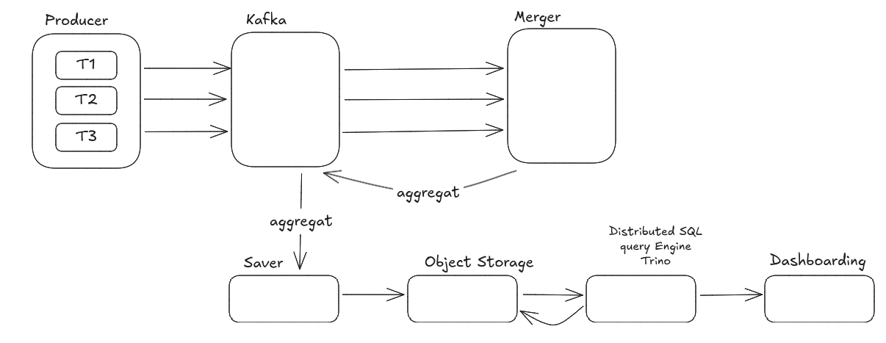

# Tanit

## Context

## Goals
Notre objectif est de pouvoir créer des ressources depuis notre producer qui va s'occuper de dispatch des events dans différents topics (selon si c'est un ferri, une voiture ou un passager), suite à nous aurons un service de merge qui va s'occuper d'aggréger les données liés pour en produire un chunck qui sera publié dans un topic Kafka.

Après cette publication, un autre service consommera un topic et s'occupera de le stocker quelques parts.

La dernière partie se portera sur l'utilisation de Trino pour faire du "BigQuery" et l'accrocher sur un dashboard.


## Service Producer
- Créer des ferries /ferris
```json
{
id: string,
name: string,
capacity: int,
}
```
- Créer des voitures /cars
```json
{
id: string,
license plate: string,
brand: string,
color: string,
capacity: int,
passengers: passenger[ ],
}
``` 

- Créer des passagers /passengers

```json
{
id : string,
firstname : string,
lastname : string,
date_of_birth : date,
sex : boolean,
}
```